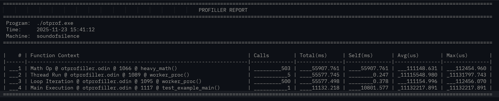
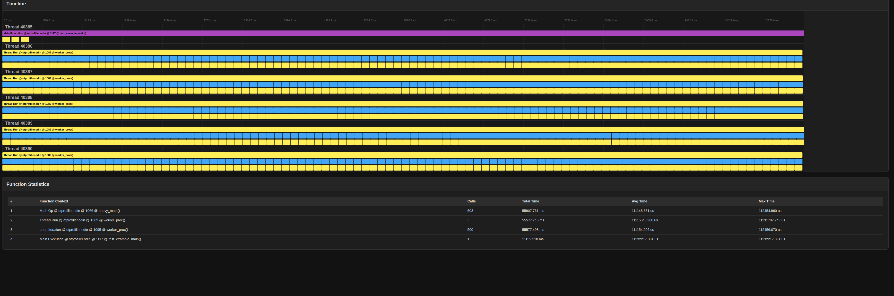

# otprofiller - Odin terminal profiller lib
Small lib to make a very simple instrumentation profiller in Odin.

## Description
- This small lib is to be embedded on a program and stay there enabled or disabled.
- It can be enabled or disabled with a very small hit on the overal performance.  
- It generates 2 reports: 
  1. profiller_report.txt
  2. profiller_report.html  ( this one has also a kind of flame graph in it )
- Note: At the end of the file there is a small test example of its usage.

## Images of the reports

### TXT report

### HTML report

## License
MIT Open Source license

## Have fun
Best regards,  
Joao Carvalho
